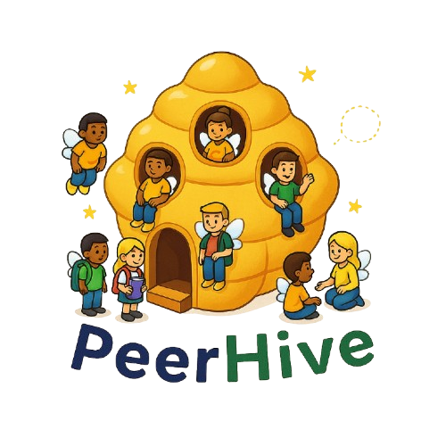

# 🐝 PeerHive

  

<!-- Botón al branch main de PeerHive -->

  

**PeerHive** es un sistema backend para la **administración de asesorías académicas**, diseñado para gestionar usuarios, sesiones, tickets de clases y comunicación en tiempo real entre estudiantes y asesores.

Este proyecto surge como evolución del frontend desarrollado en el curso de Fundamentos de Software:

🔗 Proyecto frontend original:  
[Equipo-6-Fundamentos-De-Software](https://github.com/David-Alcocer/Equipo-6-Fundamentos-De-Software)

🔗 Repositorio actual (Backend):  
[PeerHive](https://github.com/David-Alcocer/PeerHive)

---

## 📌 ¿Qué es PeerHive?

PeerHive es una API REST construida con [FastAPI](https://fastapi.tiangolo.com/) que permite:

- 🔐 Autenticación con [Microsoft Entra ID](https://learn.microsoft.com/entra/identity/)
- 👤 Gestión y CRUD de usuarios
- 🎫 Creación y asignación de tickets de asesorías
- 💬 Sistema de chat en tiempo real con WebSockets
- 🗓️ Gestión de calendario basado en relaciones usuario-estudiante
- 🛡️ Administración de sesiones y verificación de roles
- 📡 Integración con APIs externas como [Microsoft Graph](https://learn.microsoft.com/graph/overview)

PeerHive funciona como el **motor lógico y de seguridad** que puede ser consumido por cualquier cliente frontend (web, móvil o SPA).

---

## 🎯 Objetivos del Backend

### 1️⃣ Centralizar la lógica de negocio
Separar completamente la lógica del frontend para garantizar escalabilidad y mantenibilidad.

### 2️⃣ Implementar autenticación segura
Integración con:
- [OAuth 2.0](https://oauth.net/2/)
- [Microsoft Entra ID](https://learn.microsoft.com/entra/identity/)

Para asegurar inicio de sesión institucional y protección de rutas.

### 3️⃣ Gestionar el ciclo completo de asesorías

- Crear tickets de clase
- Asignar asesores
- Registrar estado de asesorías
- Administrar usuarios (estudiantes, asesores, admins)

### 4️⃣ Implementar comunicación en tiempo real

Uso de:
- [WebSockets](https://developer.mozilla.org/en-US/docs/Web/API/WebSockets_API)
- Soporte nativo en [FastAPI](https://fastapi.tiangolo.com/advanced/websockets/)

Para chat entre usuarios dentro de la plataforma.

### 5️⃣ Exponer una API documentada automáticamente

Documentación interactiva generada con:
- [OpenAPI](https://www.openapis.org/)
- [Swagger UI](https://swagger.io/tools/swagger-ui/)

Disponible en:
- `/docs`
- `/redoc`

---

## 🏗️ Arquitectura

PeerHive sigue una arquitectura modular basada en:

- API REST
- Controladores separados por dominio
- Validación con Pydantic
- Gestión de configuración con variables de entorno
- Soporte para contenedores con [Docker](https://www.docker.com/)

---

## 🔐 Seguridad

- Autenticación basada en tokens OAuth2
- Manejo de sesiones
- Rutas protegidas
- Separación de roles (usuario / asesor / admin)
- Integración con Microsoft Graph API

---

## 🚀 Tecnologías utilizadas

- [Python](https://www.python.org/)
- [FastAPI](https://fastapi.tiangolo.com/)
- [Uvicorn](https://www.uvicorn.org/)
- [Pydantic](https://docs.pydantic.dev/)
- [Microsoft Entra ID](https://learn.microsoft.com/entra/identity/)
- [Microsoft Graph API](https://learn.microsoft.com/graph/overview)
- [Docker](https://www.docker.com/)

---

## 🧩 Enfoque del Proyecto

PeerHive está diseñado como:

- Backend independiente
- Escalable
- Modular
- Preparado para integrarse con múltiples frontends
- Enfocado en buenas prácticas de autenticación y arquitectura API

---

## 📄 Licencia

Pendiente de definir.

